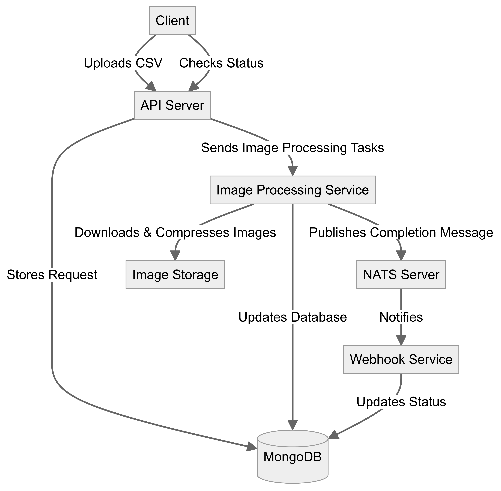

# Image Processing System

## Overview
The system processes image data from CSV files asynchronously, compresses the images, and stores the results in a database. It provides APIs to upload CSV files, check the processing status, and handle webhooks for post-processing notifications.



## Components
1. [Image Processing Service Interaction](#image-processing-service-interaction)
2. [Webhook Handling](#webhook-handling)
3. [Database Interaction](#database-interaction)
4. [API Endpoints](#api-endpoints)

## Detailed Description

### 1. Image Processing Service Interaction

**Function:**
- Downloads images from provided URLs.
- Processes images (compression).
- Stores processed images and updates the database with output URLs.

**Components:**
- **downloadImage Function:** Downloads images from given URLs.
- **processImages Function:** Compresses the images and stores them locally.
- **startProcessing Function:** Manages the processing workflow for a request.

### 2. Webhook Handling

**Function:**
- Handles callbacks from the image processing service.
- Updates the processing status and triggers notifications.

**Components:**
- **connectNats Function:** Connects to the NATS server.
- **notifyCompletion Function:** Publishes a message to a NATS topic once processing is complete.

### 3. Database Interaction

**Function:**
- Stores and tracks the status of each processing request and associated images.

**Components:**
- **MongoDB Collections:**
  - **Request Collection:** Tracks each processing request.
  - **Image Collection:** Stores image data including input and output URLs.

### 4. API Endpoints

**Function:**
- Manages CSV file uploads and status queries.

**Components:**
- **Upload API:** Accepts CSV files, initiates processing, and returns a request ID.
- **Status API:** Allows querying the status of a request using the request ID.

#### API Endpoints:

**Upload API:**
- **Endpoint:** `/api/images/upload`
- **Method:** `POST`
- **Input:** CSV file.
- **Output:** Request ID.
- **Description:** Accepts CSV files, initiates processing, and returns a unique request ID.

**Status API:**
- **Endpoint:** `/api/status/:requestId`
- **Method:** `GET`
- **Input:** Request ID.
- **Output:** Processing status.
- **Description:** Allows querying the status of a processing request using the request ID.

## Usage

### Upload CSV

Send a POST request to `/api/images/upload` with the CSV file.
## **The test csv is available under the public folder.**

```sh
curl -X POST -F 'file=@path_to_your_csv_file.csv' http://localhost:5000/api/images/upload
